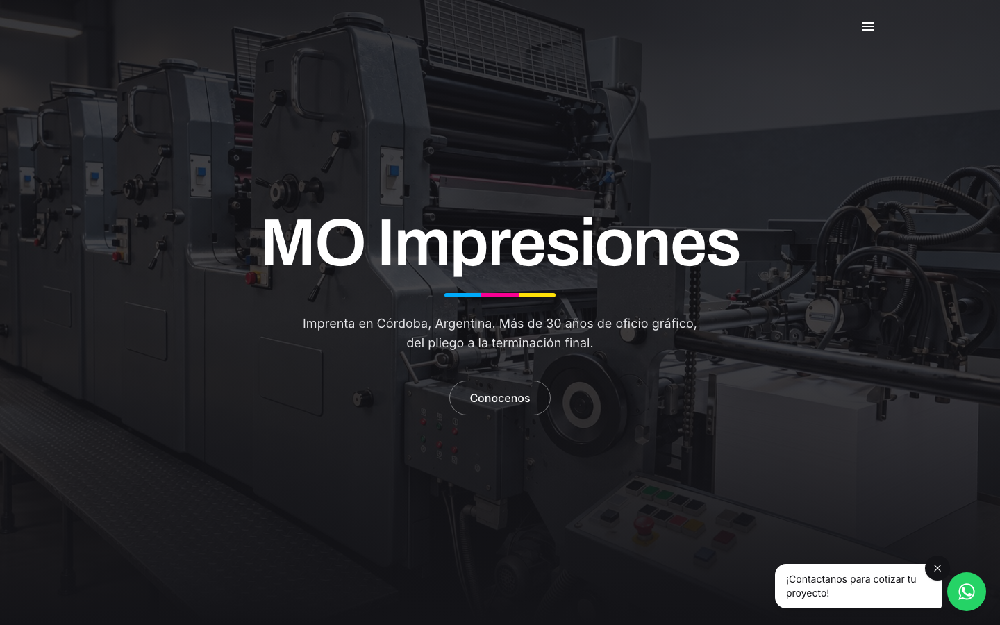
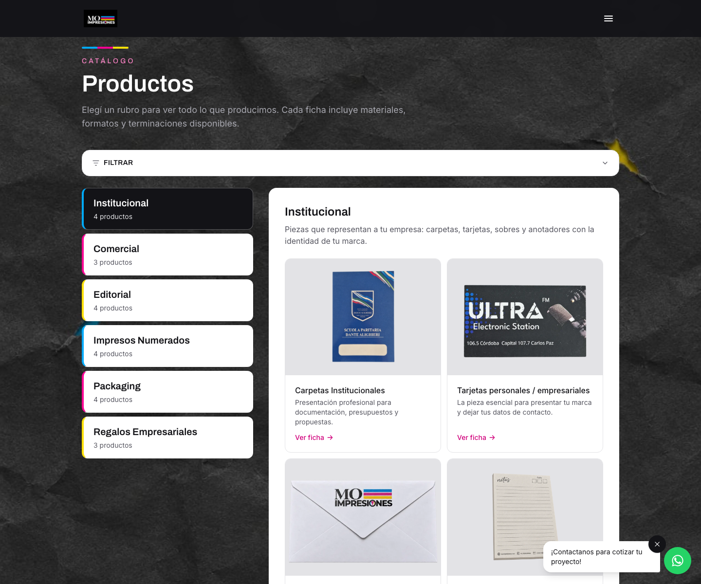
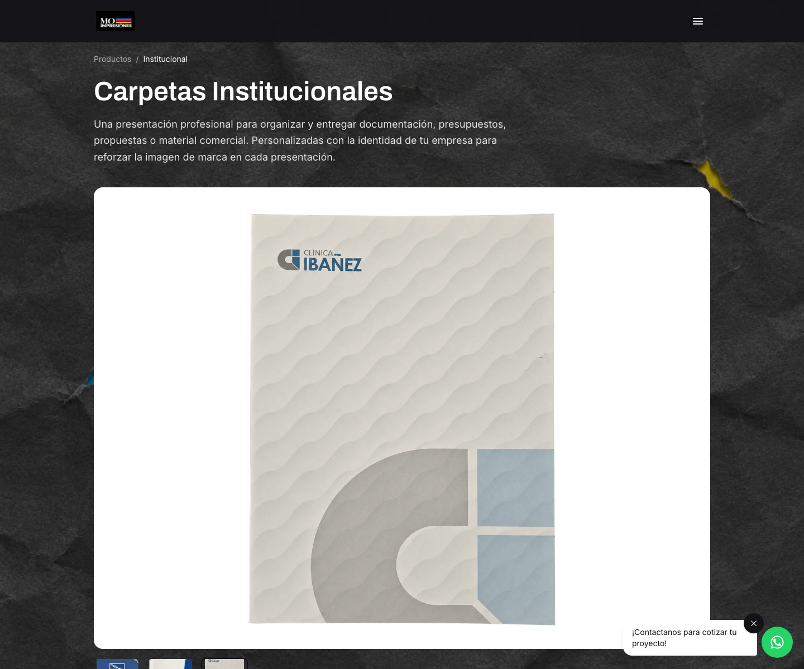
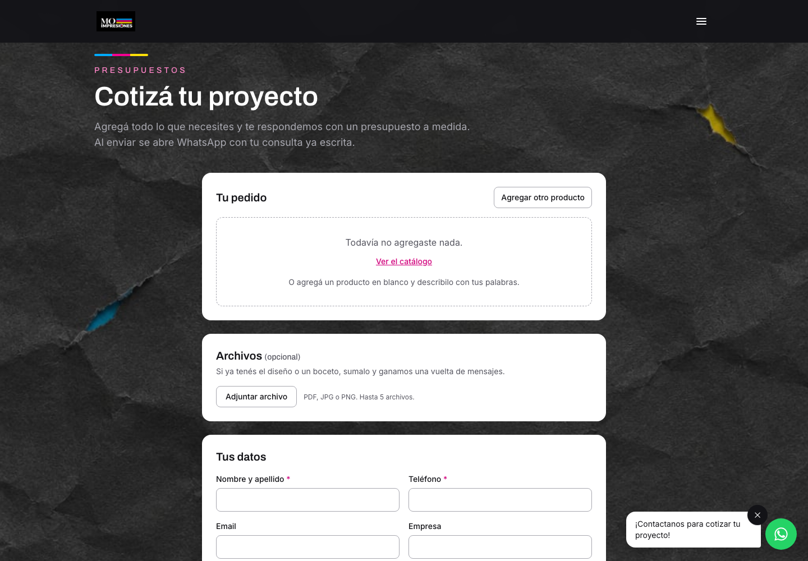
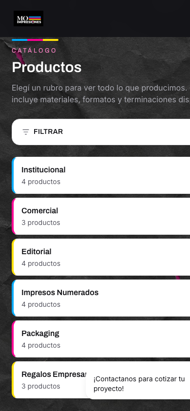

# MO Impresiones — print shop website, catalog and admin panel

[](https://github.com/Marcovf9/moimpresiones-ecommerce/actions/workflows/ci.yml)

**Live at [moimpresiones.com](https://moimpresiones.com)** · Java 21 · Spring Boot 3.5 · React 19 · PostgreSQL

A production website built for a real client: a family-run print shop in Córdoba, Argentina, in
business since 1994. It is a public catalog with a quote request flow, plus an admin panel the
owner uses to manage products, photos, incoming quotes and traffic reports — no developer needed.

The site is live, serving the business, with its own domain, HTTPS and email notifications.



> The user interface and the code comments are in Spanish, the language of the client and of the
> people who use the panel every day. This README is in English.

---

## Table of contents

- [What it does](#what-it-does)
- [Screenshots](#screenshots)
- [Architecture](#architecture)
- [Decisions worth reading](#decisions-worth-reading)
- [Tech stack](#tech-stack)
- [Project layout](#project-layout)
- [Running it locally](#running-it-locally)
- [Tests](#tests)
- [Deployment](#deployment)

---

## What it does

### Public site

- **Catalog** of 22 products across 6 categories, and 9 finishing techniques, each with photos and
  a spec sheet (materials, sizes, minimum runs, available finishes).
- **Search and filters** by finishing and material, accent-insensitive and typo-tolerant: `comics`
  finds *Cómics*, `troquelado` finds every product that offers die-cutting.
- **Multi-product quote requests** with file attachments (PDF, JPG, PNG). Submitting saves the
  request, emails the owner and opens WhatsApp with the message already written.
- **FAQ, terms, privacy policy and a map** with the shop location.
- Responsive down to 360 px, WCAG AA contrast, lazy-loaded images with placeholders, and reveal
  animations that respect `prefers-reduced-motion`.

### Admin panel (`/admin`)

- **Dashboard** with KPIs, pending tasks, weekly quote volume and most requested products.
- **Catalog editor**: products, categories, finishings, spec sheets, and photo uploads that can be
  reordered, so the owner picks which shot is the cover.
- **Quote inbox** with statuses, notes and secure attachment downloads.
- **Traffic reports** over a custom date range: visits, unique visitors, most visited pages and most
  viewed products.

---

## Screenshots

| Catalog | Product detail |
|---|---|
|  |  |

| Quote request | Mobile |
|---|---|
|  |  |

---

## Architecture

```
                 moimpresiones.com                 api.moimpresiones.com
                        │                                   │
              ┌─────────▼─────────┐             ┌───────────▼───────────┐
              │  React SPA        │   HTTPS     │  Spring Boot REST API │
              │  (Netlify CDN)    │ ──────────► │  (Render, Docker)     │
              └───────────────────┘             └───────────┬───────────┘
                                                            │
                                    ┌───────────────────────┼───────────────────────┐
                                    │                       │                       │
                             ┌──────▼──────┐        ┌───────▼───────┐       ┌───────▼───────┐
                             │ PostgreSQL  │        │  Cloudinary   │       │  SMTP (Gmail) │
                             │  + Flyway   │        │ product photos│       │ quote alerts  │
                             └─────────────┘        └───────────────┘       └───────────────┘
                                                            │
                                                    ┌───────▼────────┐
                                                    │ Persistent disk│
                                                    │ quote uploads  │
                                                    └────────────────┘
```

The backend is a layered Spring Boot application organised by feature (`catalog`, `quote`,
`analytics`, `dashboard`, `media`, `security`, `seo`, `notificaciones`), not by technical layer, so
everything one feature needs sits in one package. Storage is behind two interfaces — `MediaStorage`
for public images and `PrivateFileStorage` for quote attachments — each with a local and a cloud
implementation, selected by configuration.

The frontend is a Vite SPA. The public site and the admin panel are separate route trees, and the
admin bundle is code-split so visitors never download it.

---

## Decisions worth reading

These are the parts where the interesting trade-offs are.

**Search that tolerates accents and near misses.** Argentinians type without accents, so exact
matching silently returned nothing. A generated `search_text` column holds the product's name,
summary, description, category and its entire spec sheet, lowercased and unaccented via `unaccent`.
Ranking uses `pg_trgm`'s `word_similarity`, backed by a GIN index. The column is maintained by
`plpgsql` triggers on both tables that feed it instead of from application code: a derived value
that depends on two tables becomes stale the first time someone forgets a write path.

**Analytics without cookies, so the site needs no consent banner.** Visitors are counted through a
salted hash of IP, user agent and the current date. The date makes the identifier rotate daily, so
it cannot follow anyone over time, and the salt is generated at startup and never persisted, so the
small IPv4 space cannot be brute-forced against the database. The cost is that unique-visitor
continuity resets when the server restarts — an acceptable trade for a shop's traffic report.
Google Analytics and Google Maps were rejected for the same reason; the map uses Leaflet and
OpenStreetMap tiles.

**Email alerts that cannot slow down or break a quote.** The API publishes an event and a
`@TransactionalEventListener(AFTER_COMMIT)` sends the email on an `@Async` thread. The customer's
request is already committed and the response already sent, so a slow or unreachable SMTP server
delays nothing and loses nothing. With no `MAIL_HOST` configured, the notifier logs and returns
instead of failing.

**Private attachments, because the CDN refused to serve them.** Product photos go to Cloudinary with
per-device transformations. Customer attachments do not: this Cloudinary account blocks PDF
delivery, and quote files should not be publicly addressable anyway. They are written to a
persistent disk and served only through an authenticated admin endpoint that streams them.

**An admin password that can actually be guessed, so it is rate-limited.** JWT auth, BCrypt hashes,
and login throttling counted per username *and* per IP at once: per username alone lets anyone lock
the owner out on purpose; per IP alone is bypassed with a handful of addresses.

**Public write endpoints capped by a sliding window.** Asking for a quote needs no account and no
captcha, on purpose: every extra step loses a real customer. The cost is that a script can fill the
owner's inbox and the disk, so quote submissions and uploads are capped per IP per hour. The window
slides rather than resetting on the clock hour, which previously let a burst at 10:59 and another at
11:00 pass twice the limit.

**Photos shipped as a migration.** Deploying to a fresh database revealed that the catalog photos
only existed in the development database — production would have come up with 22 products and no
images. Migration `V11` inserts the Cloudinary URLs, matched by slug (ids differ between databases),
and only where no image exists yet, so it never overwrites what the owner changed from the panel.

**The catalog ships inside the HTML, because a crawler will not wait for a flaky API.** Search
Console reported `/productos` as a *soft 404*: Google runs the JavaScript, and it happened to render
the page while the backend was restarting, so it saw an error message instead of a catalog. The
build now writes the catalog into each page — a readable summary plus the data as JSON — and the
app starts from it, then refreshes from the API. The page is full on first paint, it survives the
API being down, and what Google renders is a catalog either way. The trade-off is that the embedded
copy ages until the next deploy, which is why the live data still overwrites it.

**One HTML file per route, so a single-page app can be indexed.** The server returned the same
`index.html` for every URL, and that file carried the home page's title and canonical link. React
rewrites them on load, but a crawler's first pass does not run JavaScript: Search Console reported
`/productos` as a duplicate of the home page and refused to index it, and sharing a product on
WhatsApp showed the home preview. A post-build script now writes one HTML file per route — 29 of
them — with its own title, description, canonical and share image, products included. It is not
server-side rendering: React still builds the body, and only the head differs. The page copy lives
in one JSON that both the pages and the script read, because the same text kept in two places
drifts apart.

**Accessible brand colors.** The client's magenta (`#f80093`) fails contrast against white at 3.1:1.
The palette keeps it for logos, CMYK bars and filled buttons, and uses a darker tone for text on
light backgrounds and a lighter one for small text on the dark paper background, all measured
against the actual background luminance rather than assumed.

---

## Tech stack

| Layer | Choice |
|---|---|
| Backend | Java 21, Spring Boot 3.5, Spring Data JPA, Spring Security, Bean Validation |
| Database | PostgreSQL 16+, Flyway migrations (11), `unaccent` + `pg_trgm` |
| Auth | JWT (jjwt), BCrypt, login throttling |
| Frontend | React 19, TypeScript, Vite, Tailwind CSS 4, React Router 7 |
| Media | Cloudinary (public images), persistent disk (private attachments) |
| Maps | Leaflet + OpenStreetMap, lazy-loaded |
| Email | Spring Mail over SMTP, async after commit |
| Hosting | Render (API + PostgreSQL, Docker), Netlify (SPA) |
| Tests | JUnit 5, Vitest + Testing Library, GitHub Actions |
| Ops | Actuator health check, WebP assets, CSP and security headers |

Roughly 5,700 lines of Java across 87 classes and 7,000 lines of TypeScript across 61 files.

---

## Project layout

```
backend/                 Spring Boot REST API
  src/main/java/com/moimpresiones/api/
    catalog/             products, categories, search and filters
    quote/               quote requests, attachments, WhatsApp message builder
    analytics/           cookieless page views and reports
    dashboard/           admin dashboard aggregation
    media/               storage abstractions (Cloudinary / local)
    security/            JWT, login throttling, password policy
    notificaciones/      email alerts for new quotes
    seo/                 sitemap.xml and robots.txt from the live catalog
  src/main/resources/db/migration/   Flyway V1–V11
frontend/                React SPA
  src/pages/             public pages
  src/admin/             admin panel (code-split bundle)
  src/components/        shared UI
  src/hooks/             data fetching, page metadata, scroll reveal
docs/                    screenshots and the Spanish README
render.yaml              Render blueprint: API + database + disk
netlify.toml             build, SPA redirects, security headers
```

---

## Running it locally

Requires Docker and Node 20+. A JDK is only needed if you run the backend outside Docker.

```bash
docker compose up -d                      # PostgreSQL on 5432
cd backend && ./mvnw spring-boot:run      # API on 8080, applies migrations
cd frontend && npm install && npm run dev # site on 5173, proxies /api
```

The panel is at `/admin`. On first start the API creates the admin user from `ADMIN_USERNAME` and
`ADMIN_PASSWORD`; leave them unset and it generates a random password and prints it once in the log.

Configuration is environment-driven — database, JWT secret, CORS origins, storage provider,
Cloudinary credentials, SMTP and contact details. See [`.env.ejemplo`](.env.ejemplo) and the
[Spanish README](docs/README.es.md) for the full table.

---

## Tests

```bash
cd backend  && ./mvnw test   # 33 JUnit tests
cd frontend && npm test      # 14 Vitest tests
```

The backend tests cover the pieces where a mistake is silent or expensive: the WhatsApp message
builder, the quote notification email, login throttling and the submission rate limiter (including
concurrent requests from one address), the password policy, Cloudinary URL handling and text
normalisation. The frontend tests cover the quote list — the one thing a visitor
builds up across pages, kept in `localStorage` — and the image transformation that keeps a 2.6 MB
photo from being served as is.

Both suites run on every push through [GitHub Actions](.github/workflows/ci.yml), and the production
Docker image runs the backend tests during the build, so a failing test never gets deployed.

---

## Deployment

`render.yaml` is a Render blueprint: one click creates the Dockerized API, a PostgreSQL instance and
a 1 GB persistent disk for attachments, already wired together, with the JWT secret generated by
Render and every secret entered in the dashboard rather than committed. `netlify.toml` builds the
SPA, keeps deep links working, proxies `sitemap.xml` and `robots.txt` from the API, and sets
security and cache headers. DNS stays at the registrar so the client's Google Workspace email is
never touched.

Step-by-step instructions are in the [Spanish README](docs/README.es.md#despliegue).

---

## About this project

Built end to end — requirements gathered from the client, database design, API, frontend, admin
panel, deployment, domain and email — as a working site for a real business rather than a demo.

**Marco Vergara** · [GitHub](https://github.com/Marcovf9)
